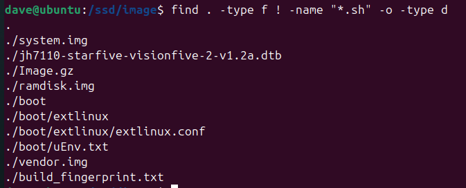
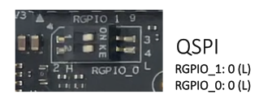

=============
Build Android
=============
Getting source and build
==========================================
Setup build environment: `https://source.android.com/setup/build/initializing <https://source.android.com/setup/build/initializing>`_

If there is a meson build error, please use Python 3.11 and set python3.11 as default.

.. code-block:: bash

    #Update meson
    sudo apt-get remove meson
    sudo apt install python3-distutils
    python3 -m pip install meson

Downnload Android Source Code

.. code-block:: bash

    repo init -u https://android.googlesource.com/platform/manifest -b android-14.0.0_r17
    git clone https://github.com/android-risc-v/local_manifests .repo/local_manifests -b arv-14
    repo sync -j8

Build Android

.. code-block:: bash

    source build/envsetup.sh
    lunch jh7110-eng
    make ramdisk systemimage vendorimage -j8

Download & Build kernel
Install cross-compiler

.. code-block:: bash

    sudo apt install gcc-riscv64-linux-gnu

Download kernel source code

.. code-block:: bash

    git clone https://github.com/android-risc-v/kernel_arv

Build kernel

.. code-block:: bash

    ARCH=riscv scripts/kconfig/merge_config.sh arch/riscv/configs/defconfig kernel/configs/android-base.config kernel/configs/android-recommended.config
    ARCH=riscv CROSS_COMPILE=riscv64-linux-gnu- make Image.gz starfive/jh7110-starfive-visionfive-2-v1.2a.dtb

Build out
=========
Android: out/target/product/jh7110

.. code-block:: text

    ramdisk.img
    system.img
    vendor.img
    build_fingerprint.txt

Kernel: kernel_arv/arch/riscv/boot

.. code-block:: text
    
    Image.gz
    dts/starfive/jh7110-starfive-visionfive-2-v1.2a.dtb

u-boot configs (AOSP source tree): device/arv/jh7110/boot

.. code-block:: text

    boot/extlinux/extlinux.conf
    boot/uEnv.txt

Collect all build files as below structure:

Flashing image
================
Partition table (SD card)

.. list-table::
   :header-rows: 1
   :widths: 15 25 20 20 20 15

   * - Partition
     - Start Sector
     - Size
     - Size
     - Type
     - Label
   * - /dev/sdb1
     - 2048
     - 262,144
     - ~128 MB
     - 83 (Linux)
     - vendor
   * - /dev/sdb2
     - after sdb1
     - 2,097,152
     - ~1 GB
     - 83 (Linux)
     - system
   * - /dev/sdb3
     - after sdb2
     - 262,144
     - ~128 MB
     - ef (EFI system)
     - boot (vfat)
   * - /dev/sdb4
     - remaining
     - remaining
     - remaining
     - 83 (Linux)
     - userdata

Partition the SD card

.. code-block:: bash

    DEVICE=/dev/sdX  # Replace X with SD card letter (e.g., /dev/sdb)

    # Unmount all partitions
    sudo umount ${DEVICE}* || true

    # Create partitions
    sudo sfdisk --force ${DEVICE} <<EOF
    label: dos
    label-id: 0xdeadbeef
    device: ${DEVICE}
    unit: sectors

    ${DEVICE}1 : start=2048, size=262144, type=83
    ${DEVICE}2 : size=2097152, type=83
    ${DEVICE}3 : size=262144, type=ef
    ${DEVICE}4 : type=83
    EOF

Format the partitions

.. code-block:: bash

    sudo mkfs.ext4 -F ${DEVICE}1 -L vendor
    sudo mkfs.ext4 -F ${DEVICE}2 -L system
    sudo mkfs.vfat ${DEVICE}3
    sudo mkfs.ext4 -F ${DEVICE}4 -L userdata

Write vendor & system partitions

.. code-block:: bash

    sudo dd if=vendor.img of=${DEVICE}1 bs=1M status=progress
    sudo dd if=system.img of=${DEVICE}2 bs=1M status=progress

Mount boot partition

.. code-block:: bash

    BOOT_MOUNT="/ssd/tmp/sdboot"
    sudo mkdir -p ${BOOT_MOUNT}
    sudo mount ${DEVICE}3 ${BOOT_MOUNT}

Copy the boot files to SD card

.. code-block:: bash
    
    # Copy the boot files
    echo "[7/7] Copying boot folder..."
    sudo mkdir -p ${BOOT_MOUNT}/boot/extlinux
    sudo mkdir -p ${BOOT_MOUNT}/boot/dtbs/starfive
    sudo cp -v ${IMAGE_DIR}/jh7110-starfive-visionfive-2-v1.2a.dtb ${BOOT_MOUNT}/boot/dtbs/starfive
    sudo cp -v ${IMAGE_DIR}/boot/extlinux/extlinux.conf ${BOOT_MOUNT}/boot/extlinux/
    sudo cp -v ${IMAGE_DIR}/boot/uEnv.txt ${BOOT_MOUNT}/boot/
    sudo cp -v ${IMAGE_DIR}/ramdisk.img ${BOOT_MOUNT}/
    sudo mkdir -p ${BOOT_MOUNT}/dtbs/starfive
    sudo cp -v ${IMAGE_DIR}/jh7110-starfive-visionfive-2-v1.2a.dtb ${BOOT_MOUNT}/dtbs/starfive/
    sudo cp -v ${IMAGE_DIR}/Image.gz ${BOOT_MOUNT}/

Sync and unmount

.. code-block:: bash
    
    sync
    sudo umount ${BOOT_MOUNT}
    sudo rm -rf ${BOOT_MOUNT}

*Download the flash script here:

:download:`flash_sd.sh <res/flash_sd.sh>`

Booting the board
=================
Set the board to SD boot mode by configuring the BOOT MODE DIP switch as shown below

Insert the prepared SD card into the board and power it on. The board should boot into the Android system.

Enter uboot console by pressing any key during the countdown and verify environment variables if needed

.. code-block:: bash

    StarFive # printenv bootdir bootenv bootfile fdtfile
    bootdir=/boot
    bootenv=/boot/uEnv.txt
    bootfile=/boot/extlinux/extlinux.conf
    fdtfile=starfive/jh7110-starfive-visionfive-2-v1.2a.dtb

Android Boot messages example:

.. code-block:: none
    
    U-Boot SPL 2021.10 (Feb 12 2023 - 18:15:33 +0800)
    DDR version: dc2e84f0.
    Trying to boot from SPI

    OpenSBI v1.2
    ____                    _____ ____ _____
    / __ \                  / ____|  _ \_   _|
    | |  | |_ __   ___ _ __ | (___ | |_) || |
    | |  | | '_ \ / _ \ '_ \ \___ \|  _ < | |
    | |__| | |_) |  __/ | | |____) | |_) || |_
    \____/| .__/ \___|_| |_|_____/|____/_____|
        | |
        |_|

    Platform Name             : StarFive VisionFive V2
    Platform Features         : medeleg
    Platform HART Count       : 5
    Platform IPI Device       : aclint-mswi
    Platform Timer Device     : aclint-mtimer @ 4000000Hz
    Platform Console Device   : uart8250
    Platform HSM Device       : jh7110-hsm
    Platform PMU Device       : ---
    Platform Reboot Device    : pm-reset
    Platform Shutdown Device  : pm-reset
    Firmware Base             : 0x40000000
    Firmware Size             : 292 KB
    Runtime SBI Version       : 1.0

    Domain0 Name              : root
    Domain0 Boot HART         : 1
    Domain0 HARTs             : 0*,1*,2*,3*,4*
    Domain0 Region00          : 0x0000000002000000-0x000000000200ffff (I)
    Domain0 Region01          : 0x0000000040000000-0x000000004007ffff ()
    Domain0 Region02          : 0x0000000000000000-0xffffffffffffffff (R,W,X)
    Domain0 Next Address      : 0x0000000040200000
    Domain0 Next Arg1         : 0x0000000042200000
    Domain0 Next Mode         : S-mode
    Domain0 SysReset          : yes

    Boot HART ID              : 1
    Boot HART Domain          : root
    Boot HART Priv Version    : v1.11
    Boot HART Base ISA        : rv64imafdcbx
    Boot HART ISA Extensions  : none
    Boot HART PMP Count       : 8
    Boot HART PMP Granularity : 4096
    Boot HART PMP Address Bits: 34
    Boot HART MHPM Count      : 2
    Boot HART MIDELEG         : 0x0000000000000222
    Boot HART MEDELEG         : 0x000000000000b109

    U-Boot 2021.10 (Feb 12 2023 - 18:15:33 +0800), Build: jenkins-VF2_515_Branch_SDK_Release-24

    CPU:   rv64imacu
    Model: StarFive VisionFive V2
    DRAM:  4 GiB
    MMC:   sdio0@16010000: 0, sdio1@16020000: 1
    Loading Environment from SPIFlash... SF: Detected gd25lq128 with page size 256 Bytes, erase size 4 KiB, total 16 MiB
    OK
    StarFive EEPROM format v2

    --------EEPROM INFO--------
    Vendor : StarFive Technology Co., Ltd.
    Product full SN: VF7110B1-2253-D004E000-40000984
    data version: 0x2
    PCB revision: 0xb2
    BOM revision: A
    Ethernet MAC0 address: 6c:cf:39:00:6e:30
    Ethernet MAC1 address: 6c:cf:39:00:6e:31
    --------EEPROM INFO--------

    In:    serial@10000000
    Out:   serial@10000000
    Err:   serial@10000000
    Model: StarFive VisionFive V2
    Net:   eth0: ethernet@16030000, eth1: ethernet@16040000
    switch to partitions #0, OK
    mmc1 is current device
    found device 1
    bootmode flash device 1
    399 bytes read in 4 ms (96.7 KiB/s)
    Importing environment from mmc1 ...
    Can't set block device
    Hit any key to stop autoboot:  0 
    41022 bytes read in 8 ms (4.9 MiB/s)
    41022 bytes written in 25 ms (1.6 MiB/s)
    Retrieving file: //extlinux/extlinux.conf
    317 bytes read in 6 ms (50.8 KiB/s)
    1:	Android
    Retrieving file: /ramdisk.img
    1476921 bytes read in 67 ms (21 MiB/s)
    Retrieving file: /Image.gz
    8569105 bytes read in 365 ms (22.4 MiB/s)
    append: console=ttyS0,115200 earlycon no_console_suspend stmmaceth=chain_mode:1 androidboot.hardware=jh7110 androidboot.selinux=permissive androidboot.serialno=10000000abcd1234
    Retrieving file: /dtbs/starfive/jh7110-starfive-visionfive-2-v1.2a.dtb
    41022 bytes read in 9 ms (4.3 MiB/s)
    Uncompressing Kernel Image
    ## Flattened Device Tree blob at 48000000
    Booting using the fdt blob at 0x48000000
    Using Device Tree in place at 0000000048000000, end 000000004800d03d

    Starting kernel ...

    clk u5_dw_i2c_clk_core already disabled
    clk u5_dw_i2c_clk_apb already disabled
    [    0.000000] Linux version 6.5.0-g64dff1103046 (dave@ubuntu) (riscv64-linux-gnu-gcc (Ubuntu 13.3.0-6ubuntu2~24.04) 13.3.0, GNU ld (GNU Binutils for Ubuntu) 2.42) #1 SMP PREEMPT Sun Oct 19 15:13:23 +07 2025
    [    0.000000] Machine model: StarFive VisionFive 2 v1.2A
    [    0.000000] SBI specification v1.0 detected
    [    0.000000] SBI implementation ID=0x1 Version=0x10002
    [    0.000000] SBI TIME extension detected
    [    0.000000] SBI IPI extension detected
    [    0.000000] SBI RFENCE extension detected
    [    0.000000] SBI SRST extension detected
    [    0.000000] earlycon: uart0 at MMIO32 0x0000000010000000 (options '115200n8')
    [    0.000000] printk: bootconsole [uart0] enabled
    [    0.000000] efi: UEFI not found.
    [    0.000000] Reserved memory: created CMA memory pool at 0x0000000080000000, size 512 MiB
    [    0.000000] OF: reserved mem: initialized node linux,cma, compatible id shared-dma-pool
    [    0.000000] OF: reserved mem: 0x0000000080000000..0x000000009fffffff (524288 KiB) map reusable linux,cma
    [    0.000000] OF: reserved mem: 0x0000000040000000..0x000000004007ffff (512 KiB) nomap non-reusable opensbi@40000000
    [    0.000000] Zone ranges:
    [    0.000000]   DMA32    [mem 0x0000000040000000-0x00000000ffffffff]
    [    0.000000]   Normal   [mem 0x0000000100000000-0x000000013fffffff]
    [    0.000000] Movable zone start for each node
    [    0.000000] Early memory node ranges
    [    0.000000]   node   0: [mem 0x0000000040000000-0x000000004007ffff]
    [    0.000000]   node   0: [mem 0x0000000040080000-0x000000013fffffff]
    [    0.000000] Initmem setup node 0 [mem 0x0000000040000000-0x000000013fffffff]
    [    0.000000] SBI HSM extension detected
    [    0.000000] CPU with hartid=0 is not available
    [    0.000000] riscv: base ISA extensions acdfim
    [    0.000000] riscv: ELF capabilities acdfim
    [    0.000000] percpu: Embedded 20 pages/cpu s42424 r8192 d31304 u81920
    [    0.000000] Kernel command line: console=ttyS0,115200 earlycon no_console_suspend stmmaceth=chain_mode:1 androidboot.hardware=jh7110 androidboot.selinux=permissive androidboot.serialno=10000000abcd1234
    [    0.000000] Dentry cache hash table entries: 524288 (order: 10, 4194304 bytes, linear)
    [    0.000000] Inode-cache hash table entries: 262144 (order: 9, 2097152 bytes, linear)
    [    0.000000] Built 1 zonelists, mobility grouping on.  Total pages: 1032192
    [    0.000000] mem auto-init: stack:all(zero), heap alloc:off, heap free:off
    [    0.000000] software IO TLB: area num 4.
    [    0.000000] software IO TLB: mapped [mem 0x00000000fbfff000-0x00000000fffff000] (64MB)
    [    0.000000] Virtual kernel memory layout:
    [    0.000000]       fixmap : 0xffffffc6fea00000 - 0xffffffc6ff000000   (6144 kB)
    [    0.000000]       pci io : 0xffffffc6ff000000 - 0xffffffc700000000   (  16 MB)
    [    0.000000]      vmemmap : 0xffffffc700000000 - 0xffffffc800000000   (4096 MB)
    [    0.000000]      vmalloc : 0xffffffc800000000 - 0xffffffd800000000   (  64 GB)
    [    0.000000]      modules : 0xffffffff017b2000 - 0xffffffff80000000   (2024 MB)
    [    0.000000]       lowmem : 0xffffffd800000000 - 0xffffffd900000000   (4096 MB)
    [    0.000000]       kernel : 0xffffffff80000000 - 0xffffffffffffffff   (2047 MB)
    [    0.000000] Memory: 3488388K/4194304K available (10258K kernel code, 5117K rwdata, 4096K rodata, 2202K init, 557K bss, 181628K reserved, 524288K cma-reserved)
    [    0.000000] SLUB: HWalign=64, Order=0-3, MinObjects=0, CPUs=4, Nodes=1
    [    0.000000] rcu: Preemptible hierarchical RCU implementation.
    [    0.000000] rcu: 	RCU restricting CPUs from NR_CPUS=64 to nr_cpu_ids=4.
    [    0.000000] rcu: 	RCU debug extended QS entry/exit.
    [    0.000000] 	Trampoline variant of Tasks RCU enabled.
    [    0.000000] 	Tracing variant of Tasks RCU enabled.
    [    0.000000] rcu: RCU calculated value of scheduler-enlistment delay is 25 jiffies.
    [    0.000000] rcu: Adjusting geometry for rcu_fanout_leaf=16, nr_cpu_ids=4
    [    0.000000] NR_IRQS: 64, nr_irqs: 64, preallocated irqs: 0
    [    0.000000] riscv-intc: unable to find hart id for /cpus/cpu@0/interrupt-controller
    [    0.000000] riscv-intc: 64 local interrupts mapped
    [    0.000000] plic: interrupt-controller@c000000: mapped 136 interrupts with 4 handlers for 9 contexts.
    [    0.000000] riscv: providing IPIs using SBI IPI extension
    [    0.000000] rcu: srcu_init: Setting srcu_struct sizes based on contention.
    [    0.000000] clocksource: riscv_clocksource: mask: 0xffffffffffffffff max_cycles: 0x1d854df40, max_idle_ns: 881590404240 ns
    [    0.000001] sched_clock: 64 bits at 4MHz, resolution 250ns, wraps every 2199023255500ns
    [    0.009151] Calibrating delay loop (skipped), value calculated using timer frequency.. 8.00 BogoMIPS (lpj=16000)
    [    0.020352] pid_max: default: 32768 minimum: 301
    [    0.025499] LSM: initializing lsm=capability,selinux,integrity
    [    0.031967] SELinux:  Initializing.
    [    0.036035] Mount-cache hash table entries: 8192 (order: 4, 65536 bytes, linear)
    [    0.044246] Mountpoint-cache hash table entries: 8192 (order: 4, 65536 bytes, linear)
    [    0.054159] CPU node for /cpus/cpu@0 exist but the possible cpu range is :0-3
    [    0.063298] RCU Tasks: Setting shift to 2 and lim to 1 rcu_task_cb_adjust=1.
    [    0.071174] RCU Tasks Trace: Setting shift to 2 and lim to 1 rcu_task_cb_adjust=1.
    [    0.079639] riscv: ELF compat mode unsupported
    [    0.079648] ASID allocator disabled (0 bits)
    [    0.089366] rcu: Hierarchical SRCU implementation.
    [    0.094639] rcu: 	Max phase no-delay instances is 1000.
    [    0.100668] EFI services will not be available.
    [    0.106084] smp: Bringing up secondary CPUs ...
    [    0.113488] smp: Brought up 1 node, 4 CPUs
    [    0.119574] devtmpfs: initialized
    [    0.131670] clocksource: jiffies: mask: 0xffffffff max_cycles: 0xffffffff, max_idle_ns: 7645041785100000 ns
    [    0.142412] futex hash table entries: 1024 (order: 4, 65536 bytes, linear)
    [    0.172081] pinctrl core: initialized pinctrl subsystem
    [    0.179573] NET: Registered PF_NETLINK/PF_ROUTE protocol family
    [    0.186937] DMA: preallocated 512 KiB GFP_KERNEL pool for atomic allocations
    [    0.194792] DMA: preallocated 512 KiB GFP_KERNEL|GFP_DMA32 pool for atomic allocations
    [    0.203545] audit: initializing netlink subsys (disabled)
    [    0.209734] audit: type=2000 audit(0.124:1): state=initialized audit_enabled=0 res=1
    [    0.210181] thermal_sys: Registered thermal governor 'step_wise'
    [    0.218283] cpuidle: using governor menu
    [    0.234770] platform soc: Fixed dependency cycle(s) with /soc/interrupt-controller@c000000
    [    0.252425] platform 19840000.camss: Fixed dependency cycle(s) with /soc/csi-bridge@19800000/ports/port@1/endpoint
    [    0.264368] platform 29590000.hdmi: Fixed dependency cycle(s) with /soc/lcd-controller@29400000/port/endpoint@0
    [    0.278185] HugeTLB: registered 1.00 GiB page size, pre-allocated 0 pages
    [    0.285650] HugeTLB: 16380 KiB vmemmap can be freed for a 1.00 GiB page
    [    0.292915] HugeTLB: registered 2.00 MiB page size, pre-allocated 0 pages
    [    0.300368] HugeTLB: 28 KiB vmemmap can be freed for a 2.00 MiB page
    [    0.308398] ACPI: Interpreter disabled.
    [    0.312905] iommu: Default domain type: Translated
    [    0.318170] iommu: DMA domain TLB invalidation policy: strict mode
    [    0.325463] SCSI subsystem initialized
    [    0.329956] usbcore: registered new interface driver usbfs
    [    0.336022] usbcore: registered new interface driver hub
    [    0.341889] usbcore: registered new device driver usb
    [    0.347763] Advanced Linux Sound Architecture Driver Initialized.
    [    0.355346] vgaarb: loaded
    [    0.358668] clocksource: Switched to clocksource riscv_clocksource
    [    0.365885] VFS: Disk quotas dquot_6.6.0
    [    0.370245] VFS: Dquot-cache hash table entries: 512 (order 0, 4096 bytes)
    [    0.377995] pnp: PnP ACPI: disabled
    [    0.383276] NET: Registered PF_INET protocol family
    [    0.389335] IP idents hash table entries: 65536 (order: 7, 524288 bytes, linear)
    [    0.404130] tcp_listen_portaddr_hash hash table entries: 2048 (order: 4, 65536 bytes, linear)
    [    0.413605] Table-perturb hash table entries: 65536 (order: 6, 262144 bytes, linear)
    [    0.422135] TCP established hash table entries: 32768 (order: 6, 262144 bytes, linear)
    [    0.431219] TCP bind hash table entries: 32768 (order: 9, 2097152 bytes, linear)
    [    0.442635] TCP: Hash tables configured (established 32768 bind 32768)
    [    0.450137] UDP hash table entries: 2048 (order: 5, 196608 bytes, linear)
    [    0.457877] UDP-Lite hash table entries: 2048 (order: 5, 196608 bytes, linear)
    [    0.466279] NET: Registered PF_UNIX/PF_LOCAL protocol family
    [    0.472565] PCI: CLS 0 bytes, default 64
    [    0.477174] Trying to unpack rootfs image as initramfs...
    [    0.490783] workingset: timestamp_bits=46 max_order=20 bucket_order=0
    [    0.498515] fuse: init (API version 7.38)
    [    0.503136] 9p: Installing v9fs 9p2000 file system support
    [    0.559566] Freeing initrd memory: 1440K
    [    0.589527] NET: Registered PF_ALG protocol family
    [    0.594880] Block layer SCSI generic (bsg) driver version 0.4 loaded (major 245)
    [    0.603282] io scheduler mq-deadline registered
    [    0.608274] io scheduler kyber registered
    [    0.612756] io scheduler bfq registered
    [    0.628090] Serial: 8250/16550 driver, 4 ports, IRQ sharing disabled
    [    0.637765] SuperH (H)SCI(F) driver initialized
    [    0.658270] brd: module loaded
    [    0.671446] loop: module loaded
    [    0.679380] tun: Universal TUN/TAP device driver, 1.6
    [    0.685642] e1000e: Intel(R) PRO/1000 Network Driver
    [    0.691126] e1000e: Copyright(c) 1999 - 2015 Intel Corporation.
    [    0.698723] starfive-dwmac 16030000.ethernet: User ID: 0x41, Synopsys ID: 0x52
    [    0.706691] starfive-dwmac 16030000.ethernet: 	DWMAC4/5
    [    0.712450] starfive-dwmac 16030000.ethernet: DMA HW capability register supported
    [    0.720789] starfive-dwmac 16030000.ethernet: RX Checksum Offload Engine supported
    [    0.729115] starfive-dwmac 16030000.ethernet: Wake-Up On Lan supported
    [    0.736372] starfive-dwmac 16030000.ethernet: TSO supported
    [    0.742507] starfive-dwmac 16030000.ethernet: Enable RX Mitigation via HW Watchdog Timer
    [    0.751411] starfive-dwmac 16030000.ethernet: Enabled L3L4 Flow TC (entries=1)
    [    0.759364] starfive-dwmac 16030000.ethernet: Enabled RFS Flow TC (entries=10)
    [    0.767316] starfive-dwmac 16030000.ethernet: TSO feature enabled
    [    0.774023] starfive-dwmac 16030000.ethernet: Using 40/40 bits DMA host/device width
    [    0.786601] starfive-dwmac 16040000.ethernet: User ID: 0x41, Synopsys ID: 0x52
    [    0.794584] starfive-dwmac 16040000.ethernet: 	DWMAC4/5
    [    0.800341] starfive-dwmac 16040000.ethernet: DMA HW capability register supported
    [    0.808666] starfive-dwmac 16040000.ethernet: RX Checksum Offload Engine supported
    [    0.816994] starfive-dwmac 16040000.ethernet: Wake-Up On Lan supported
    [    0.824260] starfive-dwmac 16040000.ethernet: TSO supported
    [    0.830396] starfive-dwmac 16040000.ethernet: Enable RX Mitigation via HW Watchdog Timer
    [    0.839300] starfive-dwmac 16040000.ethernet: Enabled L3L4 Flow TC (entries=1)
    [    0.847252] starfive-dwmac 16040000.ethernet: Enabled RFS Flow TC (entries=10)
    [    0.855207] starfive-dwmac 16040000.ethernet: TSO feature enabled
    [    0.861913] starfive-dwmac 16040000.ethernet: Using 40/40 bits DMA host/device width
    [    0.874054] PPP generic driver version 2.4.2
    [    0.879007] PPP BSD Compression module registered
    [    0.884204] PPP Deflate Compression module registered
    [    0.889784] PPP MPPE Compression module registered
    [    0.895110] usbcore: registered new interface driver asix
    [    0.901092] usbcore: registered new interface driver ax88179_178a
    [    0.907840] usbcore: registered new interface driver cdc_ether
    [    0.914302] usbcore: registered new interface driver net1080
    [    0.920575] usbcore: registered new interface driver cdc_subset
    [    0.927148] usbcore: registered new interface driver zaurus
    [    0.933348] usbcore: registered new interface driver cdc_ncm
    [    0.939615] usbcore: registered new interface driver r8153_ecm
    [    0.947162] usbcore: registered new interface driver uas
    [    0.953065] usbcore: registered new interface driver usb-storage
    [    0.960056] mousedev: PS/2 mouse device common for all mice
    [    0.966327] usbcore: registered new interface driver xpad
    [    0.972316] usbcore: registered new interface driver usb_acecad
    [    0.978945] usbcore: registered new interface driver aiptek
    [    0.985136] usbcore: registered new interface driver hanwang
    [    0.991405] usbcore: registered new interface driver kbtab
    [    0.999979] device-mapper: uevent: version 1.0.3
    [    1.005353] device-mapper: ioctl: 4.48.0-ioctl (2023-03-01) initialised: dm-devel@redhat.com
    [    1.015452] sdhci: Secure Digital Host Controller Interface driver
    [    1.022268] sdhci: Copyright(c) Pierre Ossman
    [    1.027110] Synopsys Designware Multimedia Card Interface Driver
    [    1.033997] sdhci-pltfm: SDHCI platform and OF driver helper
    [    1.040870] clocksource: 13050000.timer.ch0: mask: 0xffffffff max_cycles: 0xffffffff, max_idle_ns: 79635851949 ns
    [    1.052302] clocksource: 13050000.timer.ch1: mask: 0xffffffff max_cycles: 0xffffffff, max_idle_ns: 79635851949 ns
    [    1.063728] clocksource: 13050000.timer.ch2: mask: 0xffffffff max_cycles: 0xffffffff, max_idle_ns: 79635851949 ns
    [    1.075155] clocksource: 13050000.timer.ch3: mask: 0xffffffff max_cycles: 0xffffffff, max_idle_ns: 79635851949 ns
    [    1.086615] hid: raw HID events driver (C) Jiri Kosina
    [    1.096012] usbcore: registered new interface driver usbhid
    [    1.102157] usbhid: USB HID core driver
    [    1.106586] ashmem: initialized
    [    1.110318] riscv-pmu-sbi: SBI PMU extension is available
    [    1.116294] riscv-pmu-sbi: 16 firmware and 4 hardware counters
    [    1.122712] riscv-pmu-sbi: Perf sampling/filtering is not supported as sscof extension is not available
    [    1.135699] u32 classifier
    [    1.138698]     input device check on
    [    1.142727]     Actions configured
    [    1.148792] xt_time: kernel timezone is -0000
    [    1.153910] Initializing XFRM netlink socket
    [    1.158755] NET: Registered PF_INET6 protocol family
    [    1.166038] Segment Routing with IPv6
    [    1.170161] In-situ OAM (IOAM) with IPv6
    [    1.174601] mip6: Mobile IPv6
    [    1.177978] sit: IPv6, IPv4 and MPLS over IPv4 tunneling driver
    [    1.185227] NET: Registered PF_PACKET protocol family
    [    1.190808] NET: Registered PF_KEY protocol family
    [    1.196130] 9pnet: Installing 9P2000 support
    [    1.222173] registered taskstats version 1
    [    1.240704] debug_vm_pgtable: [debug_vm_pgtable         ]: Validating architecture page table helpers
    [    1.290523] gpio gpiochip0: Static allocation of GPIO base is deprecated, use dynamic allocation.
    [    1.300782] starfive-jh7110-sys-pinctrl 13040000.pinctrl: StarFive GPIO chip registered 64 GPIOs
    [    1.312146] gpio gpiochip1: Static allocation of GPIO base is deprecated, use dynamic allocation.
    [    1.322225] starfive-jh7110-aon-pinctrl 17020000.pinctrl: StarFive GPIO chip registered 4 GPIOs
    [    1.332579] pcie-starfive 940000000.pcie: host bridge /soc/pcie@940000000 ranges:
    [    1.340863] pcie-starfive 940000000.pcie:      MEM 0x0030000000..0x0037ffffff -> 0x0030000000
    [    1.350258] pcie-starfive 940000000.pcie:      MEM 0x0900000000..0x093fffffff -> 0x0900000000
    [    1.574697] pcie-starfive 940000000.pcie: port link up
    [    1.581985] pcie-starfive 940000000.pcie: PCI host bridge to bus 0000:00
    [    1.589395] pci_bus 0000:00: root bus resource [bus 00-ff]
    [    1.595437] pci_bus 0000:00: root bus resource [mem 0x30000000-0x37ffffff]
    [    1.603007] pci_bus 0000:00: root bus resource [mem 0x900000000-0x93fffffff pref]
    [    1.611277] pci 0000:00:00.0: [1556:1111] type 01 class 0x060400
    [    1.617976] pci 0000:00:00.0: supports D1 D2
    [    1.622681] pci 0000:00:00.0: PME# supported from D0 D1 D2 D3hot D3cold
    [    1.632706] pci 0000:00:00.0: bridge configuration invalid ([bus 00-00]), reconfiguring
    [    1.641674] pci 0000:01:00.0: [1106:3483] type 00 class 0x0c0330
    [    1.648311] pci 0000:01:00.0: reg 0x10: [mem 0x00000000-0x00000fff 64bit]
    [    1.655885] pci 0000:01:00.0: PME# supported from D0 D3cold
    [    1.662311] pci_bus 0000:01: busn_res: [bus 01-ff] end is updated to 01
    [    1.669614] pci 0000:00:00.0: BAR 8: assigned [mem 0x30000000-0x300fffff]
    [    1.677092] pci 0000:01:00.0: BAR 0: assigned [mem 0x30000000-0x30000fff 64bit]
    [    1.685143] pci 0000:00:00.0: PCI bridge to [bus 01]
    [    1.690616] pci 0000:00:00.0:   bridge window [mem 0x30000000-0x300fffff]
    [    1.698239] pcieport 0000:00:00.0: enabling device (0000 -> 0002)
    [    1.705239] pcieport 0000:00:00.0: PME: Signaling with IRQ 41
    [    1.711759] pci 0000:01:00.0: enabling device (0000 -> 0002)
    [    1.718226] xhci_hcd 0000:01:00.0: xHCI Host Controller
    [    1.724018] xhci_hcd 0000:01:00.0: new USB bus registered, assigned bus number 1
    [    1.732610] xhci_hcd 0000:01:00.0: hcc params 0x002841eb hci version 0x100 quirks 0x0000000000000890
    [    1.743344] xhci_hcd 0000:01:00.0: xHCI Host Controller
    [    1.749125] xhci_hcd 0000:01:00.0: new USB bus registered, assigned bus number 2
    [    1.757273] xhci_hcd 0000:01:00.0: Host supports USB 3.0 SuperSpeed
    [    1.764363] usb usb1: New USB device found, idVendor=1d6b, idProduct=0002, bcdDevice= 6.05
    [    1.773470] usb usb1: New USB device strings: Mfr=3, Product=2, SerialNumber=1
    [    1.781419] usb usb1: Product: xHCI Host Controller
    [    1.786804] usb usb1: Manufacturer: Linux 6.5.0-g64dff1103046 xhci-hcd
    [    1.793993] usb usb1: SerialNumber: 0000:01:00.0
    [    1.799841] hub 1-0:1.0: USB hub found
    [    1.804015] hub 1-0:1.0: 1 port detected
    [    1.808957] usb usb2: New USB device found, idVendor=1d6b, idProduct=0003, bcdDevice= 6.05
    [    1.818060] usb usb2: New USB device strings: Mfr=3, Product=2, SerialNumber=1
    [    1.826011] usb usb2: Product: xHCI Host Controller
    [    1.831476] usb usb2: Manufacturer: Linux 6.5.0-g64dff1103046 xhci-hcd
    [    1.838664] usb usb2: SerialNumber: 0000:01:00.0
    [    1.844386] hub 2-0:1.0: USB hub found
    [    1.848563] hub 2-0:1.0: 4 ports detected
    [    1.854276] pcie-starfive 9c0000000.pcie: host bridge /soc/pcie@9c0000000 ranges:
    [    1.862555] pcie-starfive 9c0000000.pcie:      MEM 0x0038000000..0x003fffffff -> 0x0038000000
    [    1.871952] pcie-starfive 9c0000000.pcie:      MEM 0x0980000000..0x09bfffffff -> 0x0980000000
    [    2.062703] usb 1-1: new high-speed USB device number 2 using xhci_hcd
    [    2.174743] usb usb2-port2: over-current condition
    [    2.217388] usb 1-1: New USB device found, idVendor=2109, idProduct=3431, bcdDevice= 4.20
    [    2.226399] usb 1-1: New USB device strings: Mfr=0, Product=1, SerialNumber=0
    [    2.234253] usb 1-1: Product: USB2.0 Hub
    [    2.240089] hub 1-1:1.0: USB hub found
    [    2.244444] hub 1-1:1.0: 4 ports detected
    [    3.078839] pcie-starfive 9c0000000.pcie: port link down
    [    3.086090] pcie-starfive 9c0000000.pcie: PCI host bridge to bus 0001:00
    [    3.093490] pci_bus 0001:00: root bus resource [bus 00-ff]
    [    3.099534] pci_bus 0001:00: root bus resource [mem 0x38000000-0x3fffffff]
    [    3.107102] pci_bus 0001:00: root bus resource [mem 0x980000000-0x9bfffffff pref]
    [    3.115362] pci 0001:00:00.0: [1556:1111] type 01 class 0x060400
    [    3.122051] pci 0001:00:00.0: supports D1 D2
    [    3.126785] pci 0001:00:00.0: PME# supported from D0 D1 D2 D3hot D3cold
    [    3.136970] pci 0001:00:00.0: bridge configuration invalid ([bus 00-00]), reconfiguring
    [    3.146027] pci_bus 0001:01: busn_res: [bus 01-ff] end is updated to 01
    [    3.153365] pci 0001:00:00.0: PCI bridge to [bus 01]
    [    3.159295] pcieport 0001:00:00.0: PME: Signaling with IRQ 58
    [    3.173655] printk: console [ttyS0] disabled
    [    3.199045] 10000000.serial: ttyS0 at MMIO 0x10000000 (irq = 59, base_baud = 1500000) is a 16550A
    [    3.208871] printk: console [ttyS0] enabled
    [    3.208871] printk: console [ttyS0] enabled
    [    3.217682] printk: bootconsole [uart0] disabled
    [    3.217682] printk: bootconsole [uart0] disabled
    [    3.233242] starfive display-subsystem: bound 29400000.lcd-controller (ops dc_component_ops)
    [    3.242049] starfive-hdmi 29590000.hdmi: [drm:starfive_hdmi_bind] registered Starfive HDMI I2C bus driver success
    [    3.252730] starfive display-subsystem: bound 29590000.hdmi (ops starfive_hdmi_ops)
    [    3.261501] [drm] Initialized starfive 1.0.0 202305161 for display-subsystem on minor 0
    [    3.796293] starfive display-subsystem: [drm] fb0: starfivedrmfb frame buffer device
    [    3.805761] dwmmc_starfive 16020000.mmc: IDMAC supports 32-bit address mode.
    [    3.806544] clk: Disabling unused clocks
    [    3.812901] dwmmc_starfive 16020000.mmc: Using internal DMA controller.
    [    3.817250] ALSA device list:
    [    3.823420] dwmmc_starfive 16020000.mmc: Version ID is 290a
    [    3.826379]   #0: Dummy 1
    [    3.832009] dwmmc_starfive 16020000.mmc: DW MMC controller at irq 62,32 bit host data width,32 deep fifo
    [    3.844281] mmc_host mmc0: card is polling.
    [    4.054698] mmc_host mmc0: Bus speed (slot 0) = 198000000Hz (slot req 400000Hz, actual 399193HZ div = 248)
    [    4.273328] Freeing unused kernel image (initmem) memory: 2200K
    [    4.279421] Run /init as init process
    [    4.291507] init: init first stage started!
    [    4.296035] init: Unable to open /lib/modules, skipping module loading.
    [    4.303313] init: Copied ramdisk prop to /second_stage_resources/system/etc/ramdisk/build.prop
    [    4.312719] init: [libfs_mgr] ReadFstabFromDt(): failed to read fstab from dt
    [    4.322433] init: Using Android DT directory /proc/device-tree/firmware/android/
    [    4.329960] init: Failed to read vbmeta partitions.
    [    4.336615] mmc_host mmc0: Bus speed (slot 0) = 198000000Hz (slot req 50000000Hz, actual 49500000HZ div = 2)
    [    4.346568] mmc0: new high speed SDXC card at address 59b4
    [    4.353739] mmcblk0: mmc0:59b4 EC1S5 59.7 GiB
    [    4.363028]  mmcblk0: p1 p2 p3 p4
    [    4.370902] init: DSU not detected, proceeding with normal boot
    [    4.378803] init: [libfs_mgr] superblock s_max_mnt_count:65535,/dev/block/mmcblk0p2
    [    4.390262] EXT4-fs (mmcblk0p2): mounted filesystem fa7405f8-3304-46ff-b703-b512eade2b25 ro without journal. Quota mode: none.
    [    4.402053] init: [libfs_mgr] __mount(source=/dev/block/mmcblk0p2,target=/system,type=ext4)=0: Success
    [    4.412238] init: Switching root to '/system'
    [    4.435381] EXT4-fs (mmcblk0p1): mounted filesystem 7f199129-4de6-4a98-b53b-65cf2f76d7c2 ro without journal. Quota mode: none.
    [    4.475946] printk: init: 3 output lines suppressed due to ratelimiting
    [    5.586712] random: crng init done
    [    6.039552] init: Skipping mount of system_ext, system is not dynamic.
    [    6.046164] init: Skipping mount of product, system is not dynamic.
    [    6.052530] init: Opening SELinux policy
    [    6.066193] init: Error: Apex SEPolicy failed signature check
    [    6.072015] init: Loading APEX Sepolicy from /system/etc/selinux/apex/SEPolicy.zip
    [    6.079672] init: Failed to open package /system/etc/selinux/apex/SEPolicy.zip: No such file or directory
    [    6.128098] init: Loading SELinux policy
    [    6.176805] SELinux:  Permission bpf in class capability2 not defined in policy.
    [    6.184248] SELinux:  Permission checkpoint_restore in class capability2 not defined in policy.
    [    6.192983] SELinux:  Permission bpf in class cap2_userns not defined in policy.
    [    6.200392] SELinux:  Permission checkpoint_restore in class cap2_userns not defined in policy.
    [    6.209271] SELinux:  Class mctp_socket not defined in policy.
    [    6.215136] SELinux:  Class user_namespace not defined in policy.
    [    6.221246] SELinux: the above unknown classes and permissions will be denied
    [    6.243617] SELinux:  policy capability network_peer_controls=1
    [    6.249597] SELinux:  policy capability open_perms=1
    [    6.254579] SELinux:  policy capability extended_socket_class=1
    [    6.260513] SELinux:  policy capability always_check_network=0
    [    6.266357] SELinux:  policy capability cgroup_seclabel=0
    [    6.271766] SELinux:  policy capability nnp_nosuid_transition=1
    [    6.277698] SELinux:  policy capability genfs_seclabel_symlinks=0
    [    6.283805] SELinux:  policy capability ioctl_skip_cloexec=0
    [    6.710803] audit: type=1403 audit(6.564:2): auid=4294967295 ses=4294967295 lsm=selinux res=1
    [    6.726736] selinux: SELinux: Loaded file context from:
    [    6.732033] selinux: 		/system/etc/selinux/plat_file_contexts
    [    6.737808] selinux: 		/system_ext/etc/selinux/system_ext_file_contexts
    [    6.763723] printk: init: 3 output lines suppressed due to ratelimiting
    [    6.836652] init: init second stage started!
    [    6.916605] selinux: SELinux: Loaded file context from:
    [    6.921882] selinux: 		/system/etc/selinux/plat_file_contexts
    [    6.927699] selinux: 		/system_ext/etc/selinux/system_ext_file_contexts
    [    6.934359] selinux: 		/product/etc/selinux/product_file_contexts
    [    6.940491] selinux: 		/vendor/etc/selinux/vendor_file_contexts
    [    6.999030] init: Using Android DT directory /proc/device-tree/firmware/android/
    [    7.019260] init: Overriding previous property 'dalvik.vm.usejit':'true' with new value 'false'
    [    7.028625] audit: type=1107 audit(6.880:3): pid=1 uid=0 auid=4294967295 ses=4294967295 subj=u:r:init:s0 msg='avc:  denied  { set } for property=gralloc.drm.kms pid=1 uid=0 gid=0 scontext=u:r:vendor_init:s0 tcontext=u:object_r:default_prop:s0 tclass=property_service permissive=1'
    [    7.036103] init: Overriding previous property 'tombstoned.max_tombstone_count':'50' with new value '10'
    [    7.067084] init: Setting product property ro.product.brand to 'Android' (from ro.product.product.brand)
    [    7.420095] ueventd: ueventd started!
    [    7.435938] selinux: SELinux: Loaded file context from:
    [    7.441260] selinux: 		/system/etc/selinux/plat_file_contexts
    [    7.447132] selinux: 		/system_ext/etc/selinux/system_ext_file_contexts
    [    7.453803] selinux: 		/product/etc/selinux/product_file_contexts
    [    7.459957] selinux: 		/vendor/etc/selinux/vendor_file_contexts
    [    7.466953] ueventd: Parsing file /system/etc/ueventd.rc...
    [    7.474828] ueventd: Added '/vendor/etc/ueventd.rc' to import list
    [    7.481110] ueventd: Added '/odm/etc/ueventd.rc' to import list
    [    7.488278] ueventd: Parsing file /vendor/etc/ueventd.rc...
    [    7.587319] apexd: Bootstrap subcommand detected
    [    7.592246] apexd: ActivateFlattenedApex
    [    7.596253] apexd: Scanning /system/apex
    [    7.603152] apexd: Bind mounting /system/apex/com.android.adbd onto /apex/com.android.adbd
    [    7.613246] apexd: Bind mounting /system/apex/com.android.adservices onto /apex/com.android.adservices
    [    7.624525] apexd: Bind mounting /system/apex/com.android.appsearch onto /apex/com.android.appsearch
    [    7.635854] apexd: Bind mounting /system/apex/com.android.art.debug onto /apex/com.android.art
    [    7.646595] apexd: Bind mounting /system/apex/com.android.btservices onto /apex/com.android.btservices
    [    7.658027] apexd: Bind mounting /system/apex/com.android.configinfrastructure onto /apex/com.android.configinfrastructure
    [    7.670875] apexd: Bind mounting /system/apex/com.android.conscrypt onto /apex/com.android.conscrypt
    [    7.765697] printk: apexd: 29 output lines suppressed due to ratelimiting
    [    8.452921] prng_seeder: Hanging forever because setup failed: hwrng.read_exact in new
    [    8.452921] 
    [    8.462508] Caused by:
    [    8.465023]     No such device (os error 19)
    [    8.785401] logd.auditd: start
    [    8.788803] logd.klogd: 8642120000
    [    8.796667] servicemanager: Starting sm instance on /dev/binder
    [    8.826466] SELinux: SELinux: Loaded service context from:
    [    8.828869] logd: Loaded bug_map file: /system_ext/etc/selinux/bug_map
    [    8.832331] SELinux: 		/system/etc/selinux/plat_service_contexts

It takes ~30 minutes to launch homescreen

.. list-table::
   :widths: 100 100
   :align: left
   :header-rows: 0

   * - .. image:: res/boot_1.png
         :alt: boot1
         :width: 500px

     - .. image:: res/boot_2.png
         :alt: boot2
         :width: 500px
