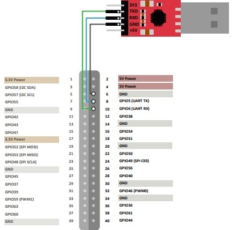

=================
Required Hardware
=================
HW preparation
=================

• VisionFive 2

• Micro-SD card (32 GB or more)

• Micro-SD card reader

• PC with Linux/windows

• USB to Serial Converter (FT232RL)

• Power adapter(5V 3A)

• USB Type-C cable

.. list-table::
   :widths: 50 50
   :align: left
   :header-rows: 0

   * - .. image:: res/vf2.jpg
         :alt: VisionFive 2 Board
         :width: 300px

     - .. image:: res/ft232.jpg
         :alt: FT232 USB to UART
         :width: 300px

Using a USB to Serial Converter
===============================

Connect to the serial device by typing the following command

.. code-block:: bash

   sudo picocom -b 115200 /dev/ttyUSB0

Sample serial output

.. code-block:: console

    StarFive #
    U-Boot SPL 2021.10 (Feb 12 2023 - 18:15:33 +0800)
    DDR version: dc2e84f0.
    Trying to boot from SPI

    OpenSBI v1.2
    ____                    _____ ____ _____
    / __ \                  / ____|  _ \_   _|
    | |  | |_ __   ___ _ __ | (___ | |_) || |
    | |  | | '_ \ / _ \ '_ \ \___ \|  _ < | |
    | |__| | |_) |  __/ | | |____) | |_) || |_
    \____/| .__/ \___|_| |_|_____/|____/_____|
            | |
            |_|

    Platform Name             : StarFive VisionFive V2
    Platform Features         : medeleg
    Platform HART Count       : 5
    Platform IPI Device       : aclint-mswi
    Platform Timer Device     : aclint-mtimer @ 4000000Hz
    Platform Console Device   : uart8250
    Platform HSM Device       : jh7110-hsm
    Platform PMU Device       : ---
    Platform Reboot Device    : pm-reset
    Platform Shutdown Device  : pm-reset
    Firmware Base             : 0x40000000
    Firmware Size             : 292 KB
    Runtime SBI Version       : 1.0

    Domain0 Name              : root
    Domain0 Boot HART         : 1
    Domain0 HARTs             : 0*,1*,2*,3*,4*
    Domain0 Region00          : 0x0000000002000000-0x000000000200ffff (I)
    Domain0 Region01          : 0x0000000040000000-0x000000004007ffff ()
    Domain0 Region02          : 0x0000000000000000-0xffffffffffffffff (R,W,X)
    Domain0 Next Address      : 0x0000000040200000
    Domain0 Next Arg1         : 0x0000000042200000
    Domain0 Next Mode         : S-mode
    Domain0 SysReset          : yes

    Boot HART ID              : 1
    Boot HART Domain          : root
    Boot HART Priv Version    : v1.11
    Boot HART Base ISA        : rv64imafdcbx
    Boot HART ISA Extensions  : none
    Boot HART PMP Count       : 8
    Boot HART PMP Granularity : 4096
    Boot HART PMP Address Bits: 34
    Boot HART MHPM Count      : 2
    Boot HART MIDELEG         : 0x0000000000000222
    Boot HART MEDELEG         : 0x000000000000b109

    U-Boot 2021.10 (Feb 12 2023 - 18:15:33 +0800), Build: jenkins-VF2_515_Branch_SDK_Release-24

    CPU:   rv64imacu
    Model: StarFive VisionFive V2
    DRAM:  4 GiB
    MMC:   sdio0@16010000: 0, sdio1@16020000: 1
    Loading Environment from SPIFlash... SF: Detected gd25lq128 with page size 256 Bytes, erase size 4 KiB, total 16 MiB
    OK
    StarFive EEPROM format v2

    --------EEPROM INFO--------
    Vendor : StarFive Technology Co., Ltd.
    Product full SN: VF7110B1-2253-D004E000-40000984
    data version: 0x2
    PCB revision: 0xb2
    BOM revision: A
    Ethernet MAC0 address: 6c:cf:39:00:6e:30
    Ethernet MAC1 address: 6c:cf:39:00:6e:31
    --------EEPROM INFO--------

    In:    serial@10000000
    Out:   serial@10000000
    Err:   serial@10000000
    Model: StarFive VisionFive V2
    Net:   eth0: ethernet@16030000, eth1: ethernet@16040000
    switch to partitions #0, OK
    mmc1 is current device
    found device 1
    bootmode flash device 1
    399 bytes read in 4 ms (96.7 KiB/s)
    Importing environment from mmc1 ...
    Can't set block device
    Hit any key to stop autoboot:  0
    Can't set block device
    libfdt fdt_check_header(): FDT_ERR_BADMAGIC
    Retrieving file: /boot/extlinux/extlinux.conf
    Can't set block device
    Error reading config file
    StarFive #
